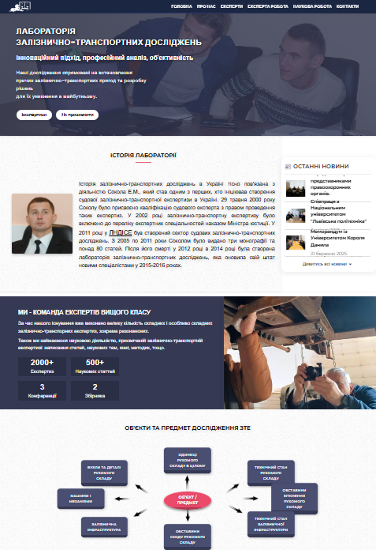
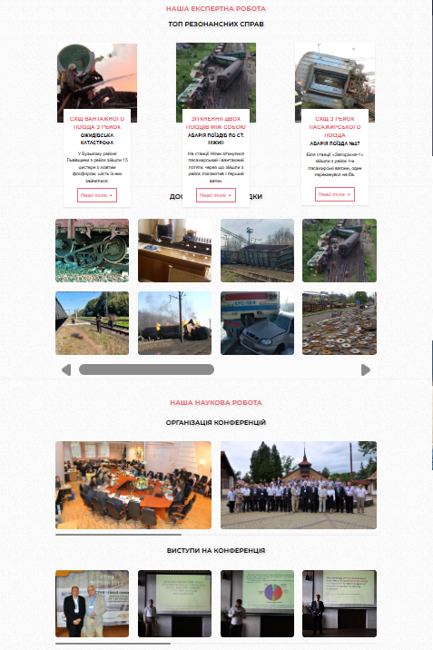
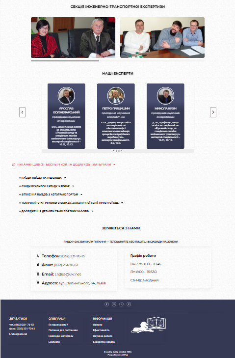
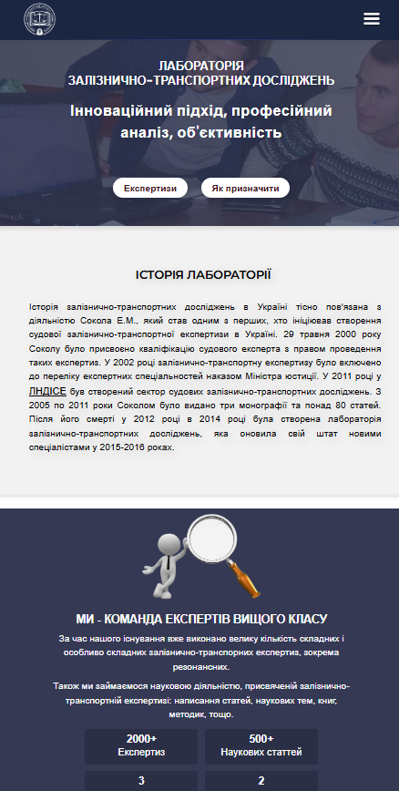
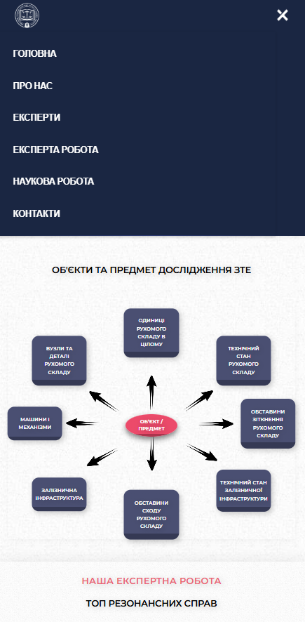

# site-for-lab

## Short description of project:
Responsive cards that fit your website's content

## VIEW
## DESKTOP version

## MOBILE version

## Prerequisites
Before you begin, ensure you have met the following requirements:
- Git must be installed on your operating system.

## Installing
To install, follow these steps:

## Linux and macOS:
sudo git clone https://github.com/BatigAndriy/site_LNDISE

## Windows:
git clone clone https://github.com/BatigAndriy/site_LNDISE

## License
This project is free to use and does not contain any license.
